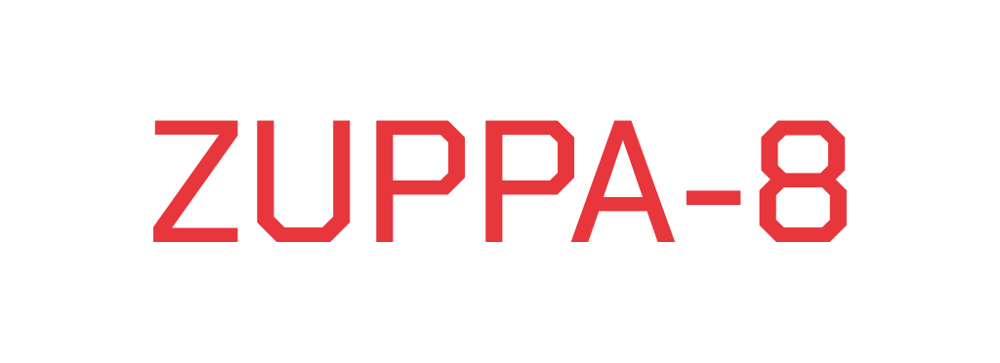
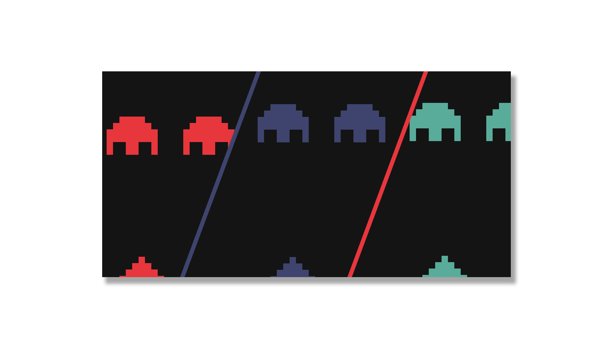
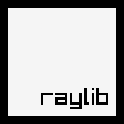

  

**Zuppa-8** is a simple CHIP-8 emulator written in *C* using *Raylib*.

The name *Zuppa-8* is just something I came up with while building the project.  
It exists as a separate name because the emulator supports **three different color modes** instead of the traditional monochrome display.

  

## What is CHIP-8?

CHIP-8 is a simple interpreted programming language created in the late 1970s.  
It was originally used on early hobbyist computer systems such as:

- COSMAC VIP
- DREAM 6800
- ETI 660

These machines typically:
- Had 1–4 KB of RAM
- Used a 16-key hexadecimal keypad for input

## Features

- CHIP-8 interpreter written in **pure C**
- Rendering powered by **Raylib**
- **3 color modes**
  - Red
  - Green
  - Blue
- Fixed CPU timing
- 60 Hz timers
- ROM loading

## References

- 📌 [CHIP-8 Technical Reference v1.0](http://devernay.free.fr/hacks/chip8/C8TECH10.HTM#0.1)

  
  

